<picture>
  <source media="(max-width: 760px)" srcset="./assets/profile-hero-mobile.svg" />
  
</picture>

 

<picture>
  <source media="(prefers-color-scheme: dark) and (max-width: 760px)" srcset="./assets/profile-editorial-dark-mobile.svg" />
  <source media="(prefers-color-scheme: dark)" srcset="./assets/profile-editorial-dark.svg" />
  <source media="(max-width: 760px)" srcset="./assets/profile-editorial-light-mobile.svg" />
  
</picture>

  <a href="https://agilemanifesto.org/">Read the original Agile Manifesto ↗</a>

  <a href="https://www.linkedin.com/in/ibrahimethemkurt/"><picture><source media="(prefers-color-scheme: dark)" srcset="./assets/linkedin-dark.svg" /></picture></a>
  &nbsp;
  <a href="https://www.instagram.com/ibrahimethemkurtcom/"><picture><source media="(prefers-color-scheme: dark)" srcset="./assets/instagram-dark.svg" /></picture></a>

