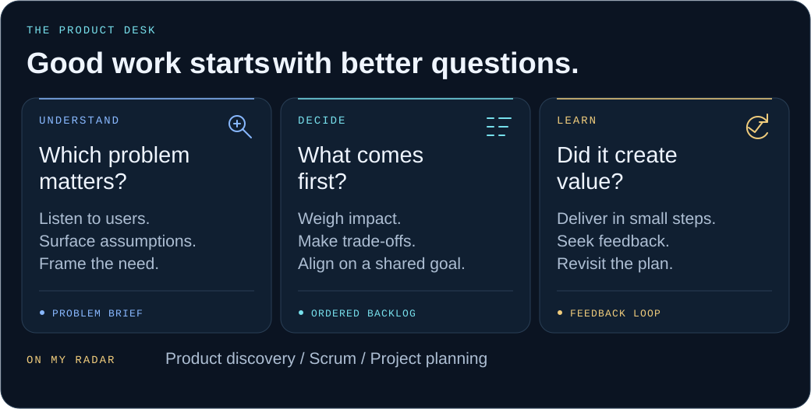
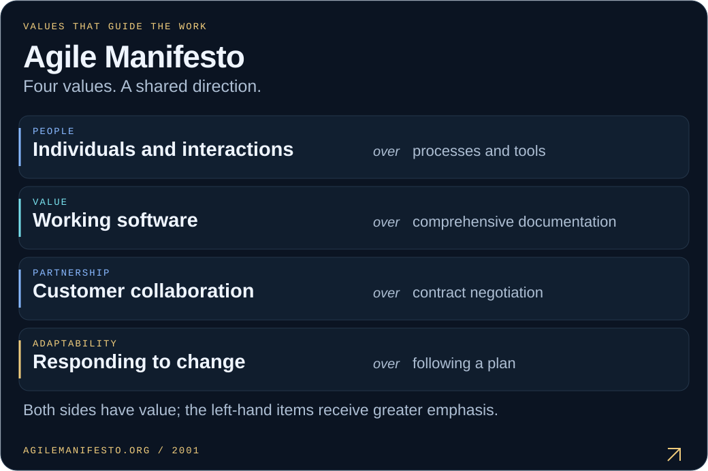

  

  A Management Information Systems background. A growing focus on <b>Product Ownership, Scrum, and Project Management.</b> 
  Curious about the problem. Intentional about priorities. Always learning from the outcome.

<picture>
  <source media="(max-width: 600px)" srcset="./assets/product-desk-mobile.svg" />
  
</picture>

 

<a href="https://agilemanifesto.org/">
  <picture>
    <source media="(max-width: 600px)" srcset="./assets/agile-values-mobile.svg" />
    
  </picture>
</a>

  Four values from the <a href="https://agilemanifesto.org/">Manifesto for Agile Software Development</a> · 2001

  <a href="https://www.linkedin.com/in/ibrahimethemkurt">Let's connect on LinkedIn ↗</a>
  &nbsp;·&nbsp;
  <a href="https://github.com/ibrahimethemkurt?tab=repositories">Explore my projects ↗</a>

